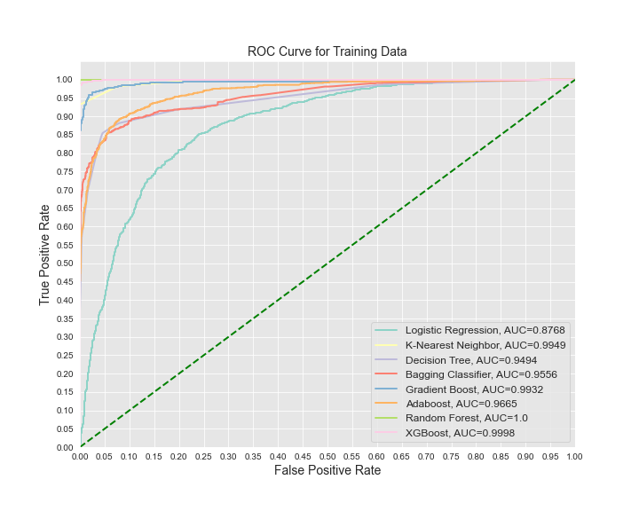

# SyriaTel Customer Churn Analysis

Author: Gamze Turan

## Overview

I will examine the "SyriaTel Customer Churn" data in this study. The SyriaTel is a telecommunication company. To determine whether a customer will ("soon") discontinue doing business with Syria Tel is the goal of the study.

The best way the determine is to make a predictive model which will classify customers who might stop doing business with Syria Tel, using the data.

I will build a model for classifying whether customer will stop business True or False.

## Business Understanding

This search will detecting which customers are likely to leave a sevice or to cancel a subcription to a service.

Select a modelthat will be the most accurate in predicting which client will discontinue doing business with SyriaTel.

## Steps to solve project

1. Data Understanding
   * Loading Data
   * Data Overview
   * Data Preprocessing
2. Data Preparation for Modeling 
3. Model 1 — Logistic Regression 
4. Model 2 — K-Nearest Neighbors 
5. Model 3 — Decision Tree 
6. Model 4 — Gradient Boost
7. Model 5 — Ada Boost
8. Model 6 — Random Forest 
9. Model 7 — XGBoost + Grid Search
10. Compare Models
11. Summary

## Data Understanding

### Loading Data 

I downloaded dataset "SyriaTel Customer Churn" from Kaggle that is used for observation.

The file name is 'bigml_59c28831336c6604c800002a.csv'.

Tha raw data has 3333 entries and 21 columns.

### Data Overview

- state 
- account length
- area code
- international plan
- voice mail plan
- number vmail messages
- total day minutes
- total day calls
- total day charge
- total eve minutes
- total eve calls
- total eve charge
- total night minutes
- total night calls
- total night charge
- total intl minutes
- total intl calls
- total intl charge
- customer service calls
- churn

After the observation of data we noticed that there are no missing values in the dataset.
Phone number columns is not important for modeling the data because it store random numbers
and we can't create dummy values that's why we will remove this columns.

## Data Preprocessing

I create a scatter plot to check total customer spending over time. You can see a line of cancelling customers above the staying ones, indicating higher spend for some cancelling customer

## Data Preparation for Modeling

Before modeling I created a copy of the dataset. Then I spllit the dataset into target data series (y) and predictor dataframe (X).

y: DataSeries of 'churn'
X: DataFrame of all predictors
I also created dummy variables from categorical variables.

Then,splitting data into training, validation and test sets. First I split data into 2 parts, say temporary and test I seperated the data into train and test splits.After that spit the temporary set into train and validation. I allocated 25% of the data for testing. I also assigned a random state for repeatability.

The shape of the splits:

> X_train shape =  (1999, 74)
> y_train shape =  (1999,)
> X_test shape =  (667, 74)
> y_test shape =  (667,)
> shape = (number of rows/entries, number of columns/variables)

> Number of rows in train data = 1999
> Number of rows in validation data = 667
> Number of rows in test data = 667

The next step is standardization and normalization . The data values have different ranges, so I did normalize/scale each variable in train and test data (X) before modeling.

## Evaluation 

 I will use several classifiers to model the data. I will check their performance using the evaluation metrics:
 

precision:

Number of True Positives / Number of Predicted Positives
How precise our predictions are?

recall:

Nuber of True Positives / Number of Actual Total Positives
What percentage of the classes we're interested in were actually captured by the model?

accuracy:

(Number of True Positives + Number of True Negatives) / (Number of Total Observations)
Out of all the predictions our model made, what percentage were correct?

f1-score:

2 * (Precision * Recall) / (Precision + Recall)
Harmonic Mean of Precision and Recall.

Source: Flatiron Data Science Curriculum, Evaluation Metrics

The main business problem in this analysis is focusing on identfying the customers who stop doing business. I am interested in on the 'recall' and 'precison' metrics. The recall and precision are inversely proportional. Therefore, I choose to use the f1-score, Harmonic Mean of Precision and Recall, as the main metric for evaluating the performance of the model.

## Logistic Regression

Here, a ROC Curve can be used to show the performance of a classification model at all classification thresholds. This curve plots two parameters: true positive rate and false positive rate.

Area Under the ROC Curve(AUC): An aggregated metric that evaluates how well a logistic regression model classifies positive and negative outcomes at all possible cutoffs. It can range from 0.5 to 1, and the larger the better.

The AUC of .79 indicates that this model is sorting the values at an acceptable way, but not an excellent way.

Training Data:
               precision    recall  f1-score   

           0       0.82      0.79      0.81     
           1       0.80      0.83      0.82            

Testing Data:
               precision    recall  f1-score   

           0       0.94      0.77      0.85       
           1       0.34      0.69      0.45  
           
After resampling, the Logistic Regression Model performance is clearly improved.The performance in training data is better test data. This is sign of overfitting.
           
## K-Nearest Neighbors 

The performance of the fitting on resampled training data is better. For test data, the f1-score increased from 0.15 to 0.29.(The findings for the resampled data are tested; they are not displayed here.)Overfitting was noticed.

Training Data:
               precision    recall  f1-score   

           0       1.00      0.93      0.96      
           1       0.93      1.00      0.96      

Testing Data:
               precision    recall  f1-score   

           0       0.88      0.86      0.87       
           1       0.29      0.34      0.32        

## Decision Tree

Train the AUC, and Test AUC will be indicative of training and test error for learning.5 is the ideal maximum tree depth.Greather tree depth is indicative of overfitting as Train AUC soars above Test AUC. At 6, the Test AUC is above the Train AUC.

Training Data:
               precision    recall  f1-score  

           0       0.86      0.96      0.91      
           1       0.96      0.84      0.90     
Testing Data:
               precision    recall  f1-score  

           0       0.96      0.95      0.96       
           1       0.73      0.79      0.76        

The parameter tuning improved the Decision Tree performance a little.Overfitting observed.

## Gradient Boost

To reduce to overall prediction error, Gradient Boost combines the prior models with the next best model that might be used. This classification model's prediction error gauges how accurately it forecast the variable of client churn.

Training score:
        Precision Score: 1.0
        Recall Score: 0.85
        Accuracy Score: 0.98
        F1 Score: 0.92
        
##  Ada Boost

Adaboost helps you combine multiple weak classifiers into a single strong classifier. The weak learners in AdaBoost are decision trees with a single split, called decision stumps. It works by putting more weight on difficult to classify instances and less on those already handled well.
Training score:
        Precision Score: 0.76
        Recall Score: 0.47
        Accuracy Score: 0.90
        F1 Score: 0.58
        
## Random Forest 

The parameter tuning didnt improve the performance of Random Forest model.Overfitting observed.

Training score:0.97
Testing score:0.91
Recall :0.41

## XGBoost + Grid Search

The parameter tuning didn't effect the XGBoost performance much.

Training Accuracy: 99.0%
Validation accuracy: 94.6%
Training Recall: 93.08%
Test Recall: 68.04%

## Compare Models
In this part, I will contrast the avaliable categorization models in order to determine which is the most effective at identifying potential consumers for SyriaTel.

I will now consider evaluation metrics like f1, recall, accuracy and precision.

For each model, I will also calculate AUC and plot ROC curves.

Optimum parameter sets, with f1-score used for tuning:
* Logictic Regression: {'C': 0.01, 'solver': 'liblinear'}
* KNN: Default
* Decision Trees: {'criterion': 'gini', 'max_depth': 6, 'min_samples_split': 2}
* Bagging classifier: {DescisionTreeClassifier {'criterion': 'gini', 'max_depth': 5}, 'n_estimators': 20
* Gradient Boost: Default
* Adaboost: Default
* Random Forest: Default
* XGBoost: {'learning_rate': 0.1, 'max_depth': 6, 'min_child_weight': 1, 'n_estimators': 100
             

Overall, XGBosst classifier has the best performance, according to test data Evaluation metrics. There is also shown the best Recall and F1-score.

My choice of the best model is XGBoost model.
             
## Summary
 
Statistics of the Final Model in concise:
It clearly identifies 74% of the real churning customer. 83% of the customers whose anticipated churn was captured by the algoritm definitely did so (clearly remember).(accuracy)The f1-score's Harmonic Mean of Precision and Recall is 78%.

The experimental database's identification number are:

### Unique identifiers:

72 confirmed positives were found

There are 556 genuine  negatives.

14 false alarms were discovered.

25 erroneous alarms were discovered.

72 out of 125 customers who churn are successfully identified.

Client that churn have higher probability of having a foreign plan than others who stay users.
Compared with regular users, churn customers are reluctant to get a voicemail subcription.
Contray to incumbent users, churn clients have fewer voicemails(as a result of less voicemail plan).
Users with churn generate more queries to customer service than do customer base.
In contrast to continuous customers, churn users have greater total dat minutes.

## Business Recommendations:

* Improve international plan to attract customers.

* For greater satisfaction, revamp its helpdesk(customer service).

* Accept a deal at discount with enough cumulative day moments.

## Next Step

Ensure smooth functioning of the XGBT design(completed model).

To understand how parameter influences the performance, browse for it properly

To facilitate a better understanding and familarity of each parameter exploited in grid search.

Analyze the influence of additional hyperparameter.

To evaluate performance of the model and to alter parameters, use a scaled f1 score that emphasizes recall more accuracy

## Repository Structure 

├── Data

├── Deliverables

├── images

├── README.md

└── syriatel_costumer_churn_analysis.ipynb

